# Sneakers E-Commerce Website

## 📝 Description du projet
Un site e-commerce dédié à la vente de sneakers. Il propose une interface moderne et intuitive avec des fonctionnalités permettant de naviguer facilement entre les différentes pages et d'interagir avec les produits.

---

## 📄 Pages principales
- **Home** : Page d'accueil.  
  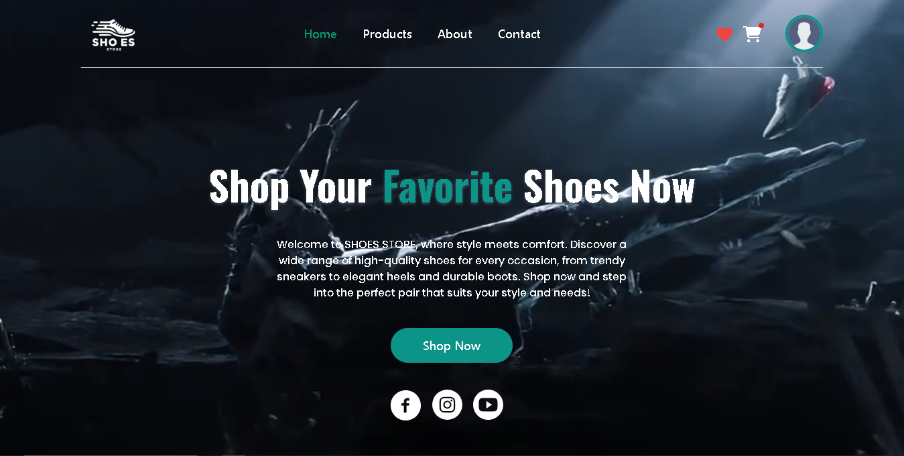
  
  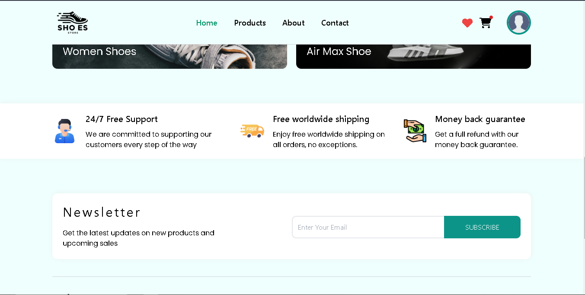
  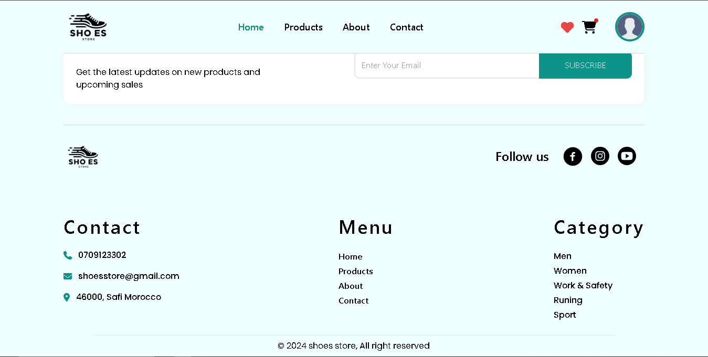
- **Products** : Liste des produits disponibles.  
  
- **About** : Informations sur le site.  
  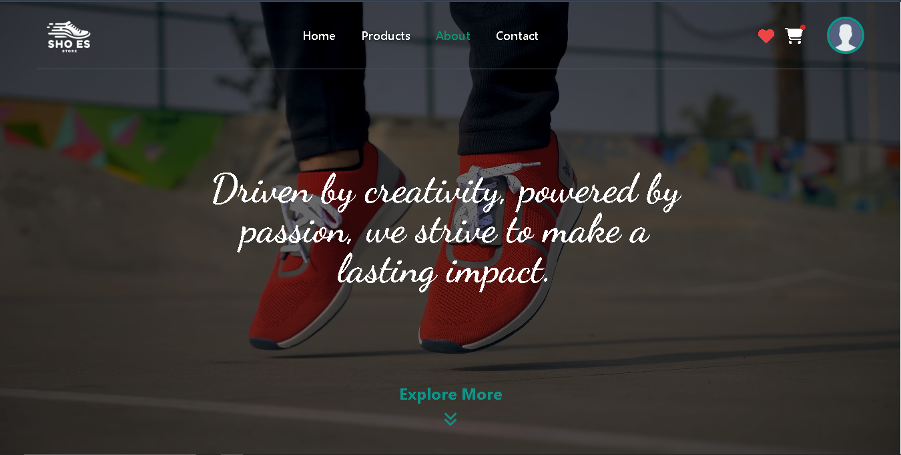
  
  
  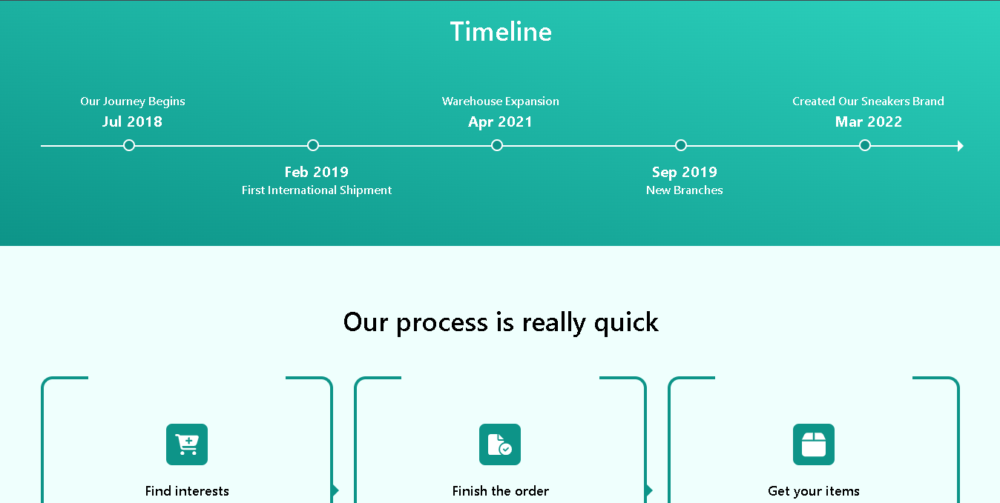
  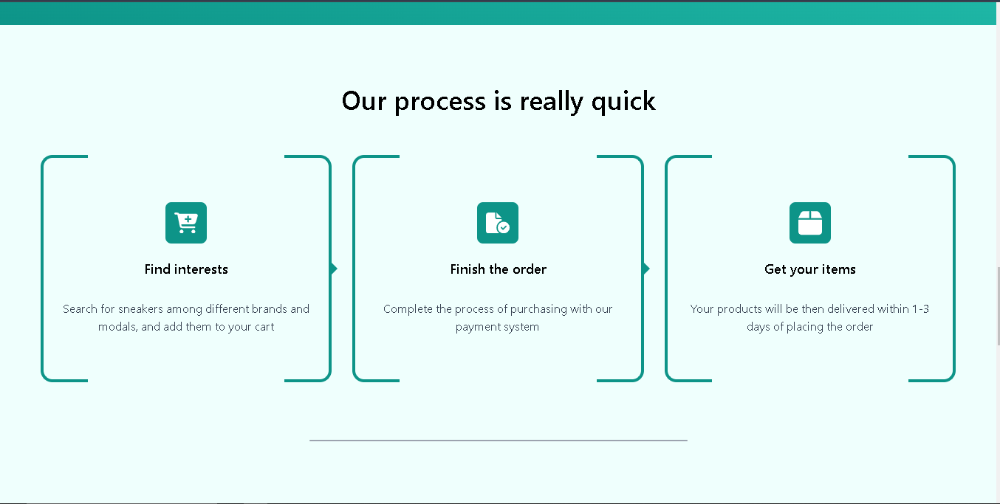
  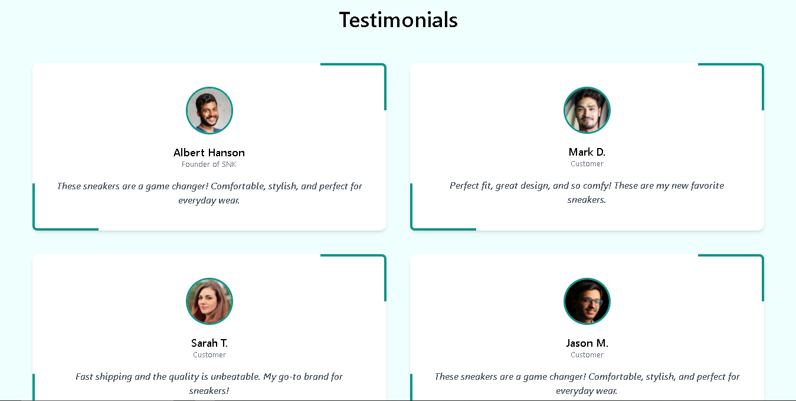
  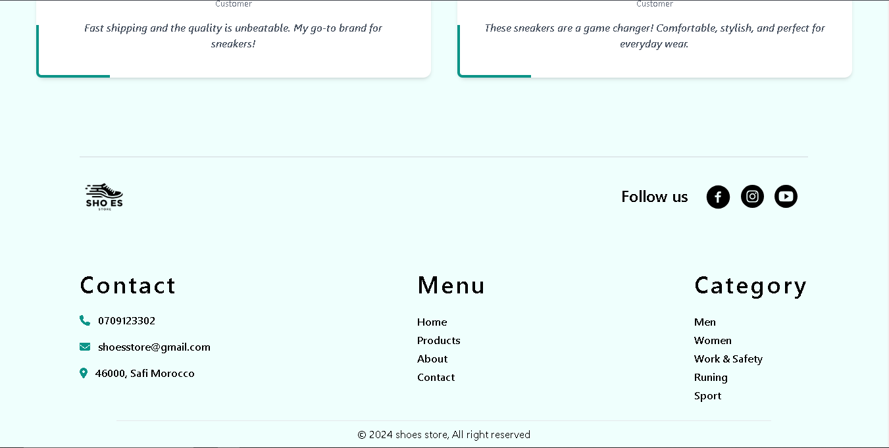
- **Contact** : Page de contact.  
  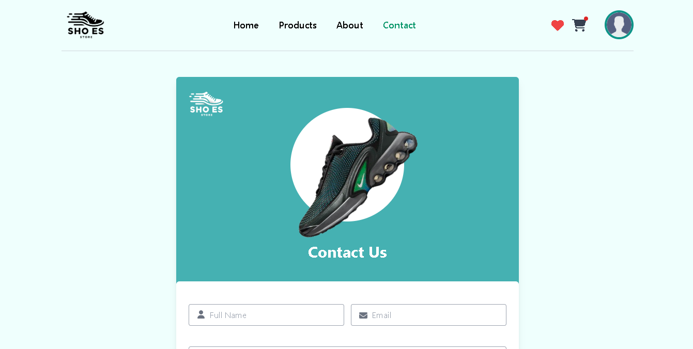
  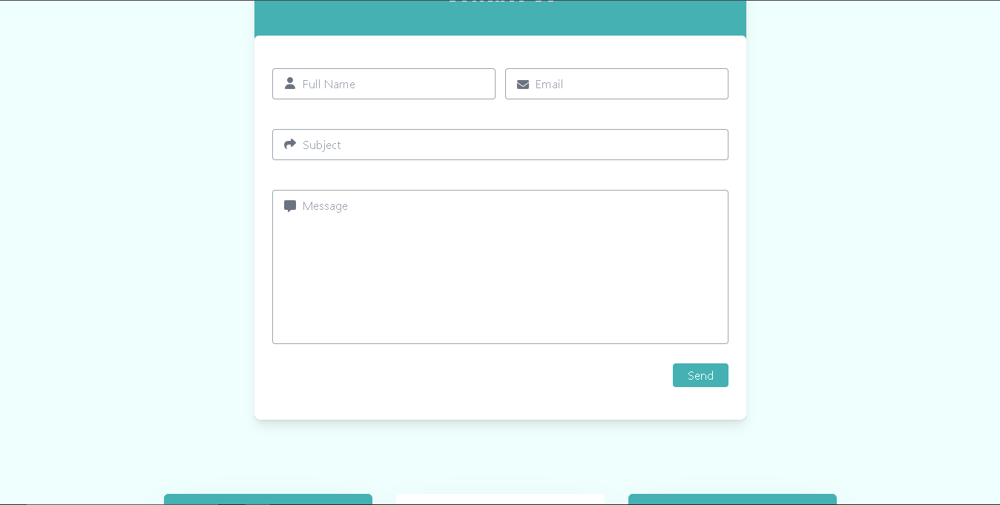
  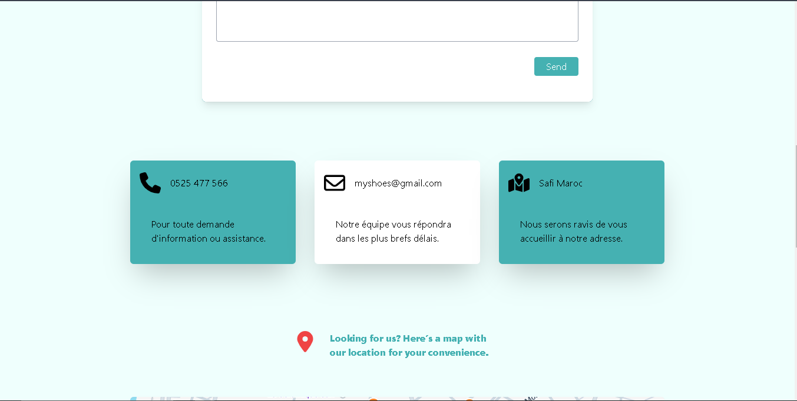
  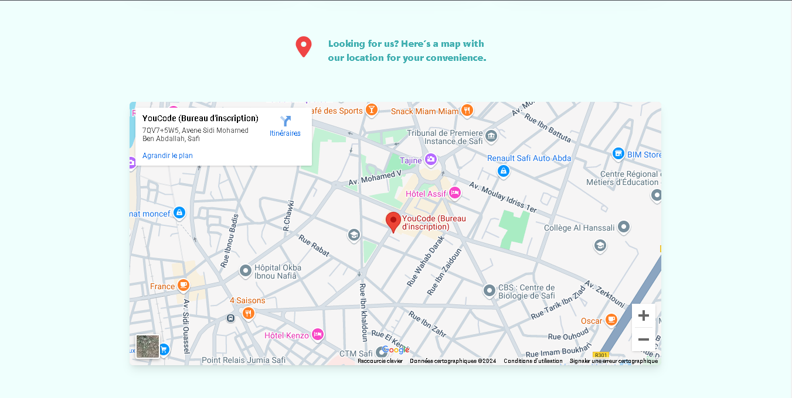
- **Login & Sign Up** : Authentification utilisateur.  
  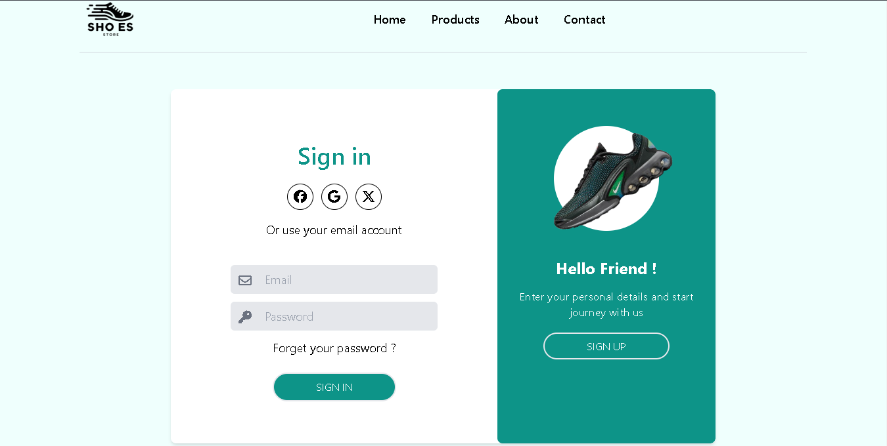
  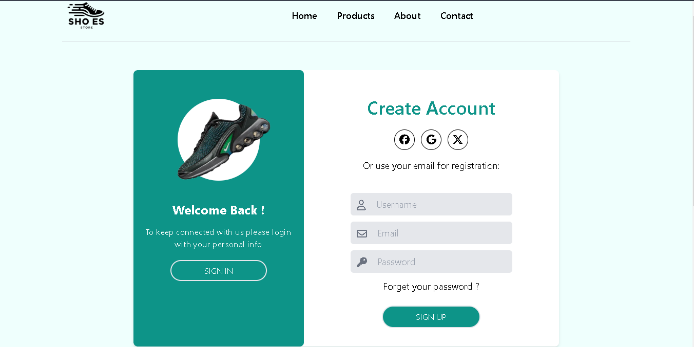
- **Favourite** : Liste des produits préférés.  
  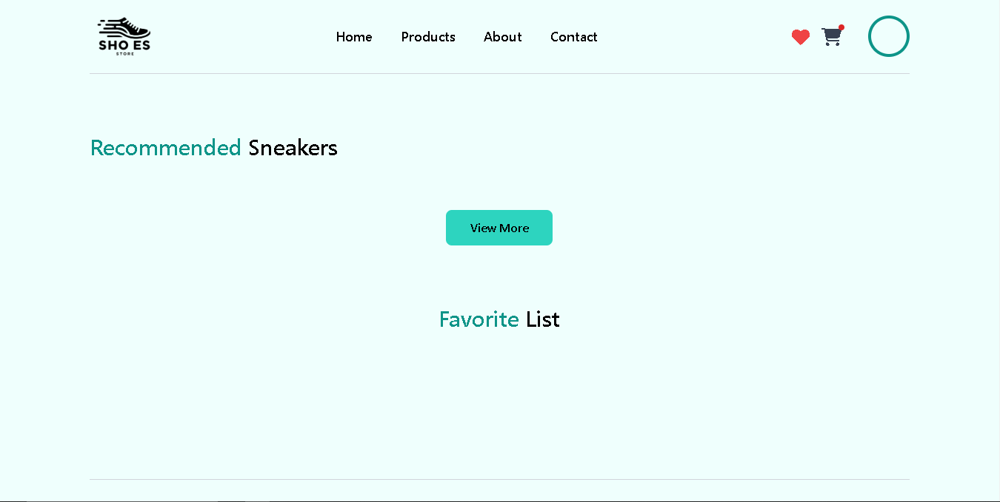

---

## ✨ Fonctionnalités principales
- Affichage des produits disponibles.
- Ajout de produits au panier.
- Ajout de produits à la liste de souhaits.
- Gestion des utilisateurs (connexion et inscription).

---

## ⚙️ Prérequis
Avant de commencer, assurez-vous d'avoir installé :
- Un éditeur de code (Visual Studio Code recommandé).
- Git pour le versionnage.
- Un navigateur moderne compatible.

---

## 🚀 Installation
1. Clonez le dépôt et accédez au dossier :
   ```bash
   git clone https://github.com/MostafaRhazlani/brief_5-Plateforme-E-commerce.git
   cd brief_5-Plateforme-E-commerce
